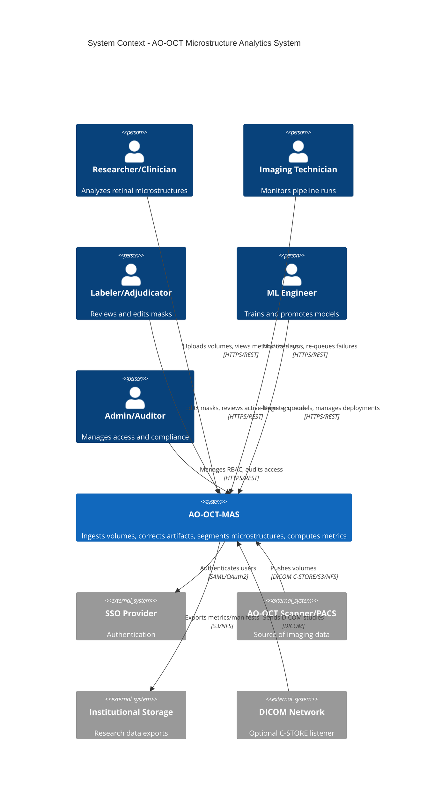

# C4: System Context

**Caption**: External actors interact with AO-OCT-MAS via REST APIs. System integrates with SSO for auth, receives data from scanners/PACS, and exports to institutional storage. All PHI boundaries enforce encryption and access control.