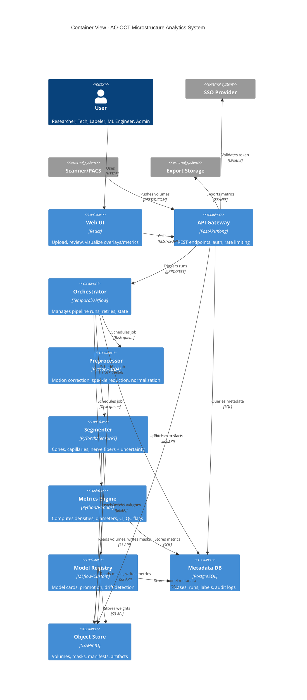

# C4: Container

**Caption**: Eight containers orchestrate the pipeline. API Gateway enforces auth/RBAC. Orchestrator schedules idempotent jobs. Preprocessor, Segmenter, Metrics Engine are GPU-accelerated workers. Model Registry manages ML lifecycle. PostgreSQL and S3 provide persistence.