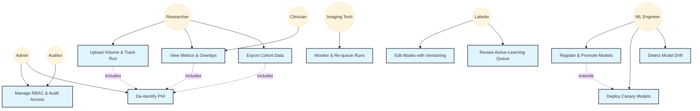

# Use Case Diagram

## Story Mapping

| Use Case | Description | Mapped Stories |
|----------|-------------|----------------|
| UC1 | Upload Volume & Track Run | Upload volume → RUN_ID (Story: RUN_ID tracking) |
| UC2 | View Metrics & Overlays | Cone density maps, overlay viz (Stories: density+uncertainty, overlay) |
| UC3 | Monitor & Re-queue Runs | Auto-flag QC<0.4 (Story: QC score) |
| UC4 | Edit Masks with Versioning | Mask edits + rollback (Story: edit mask) |
| UC5 | Review Active-Learning Queue | Uncertainty-ranked tiles (Story: active-learning) |
| UC6 | Register & Promote Models | Model card (Story: register model) |
| UC7 | Deploy Canary Models | Canary (Story: canary deploys) |
| UC8 | Manage RBAC & Audit Access | SSO+RBAC, audit logs (Stories: SSO+RBAC, access logs) |
| UC9 | Export Cohort Data | Scheduled exports (Story: cohort exports) |
| UC10 | De-identify PHI | PHI de-ID (Story: PHI de-identification) |
| UC11 | Detect Model Drift | Weekly drift check (Story: drift alerts) |

## SRS Traceability

- UC1: FR-001, FR-002, FR-004, A-01, A-02, A-03
- UC2: FR-030, FR-033, FR-040, U-01, NFR-U-01
- UC3: FR-010, FR-041, NFR-P-02
- UC4: FR-050, FR-071, U-02
- UC5: FR-051, FR-033, U-02
- UC6: FR-060, U-03, A-06
- UC7: FR-061, NFR-R-01
- UC8: FR-070, FR-071, NFR-S-01, NFR-O-01
- UC9: FR-080, FR-004
- UC10: FR-072, NFR-S-02
- UC11: FR-062, NFR-A-02, NFR-O-01