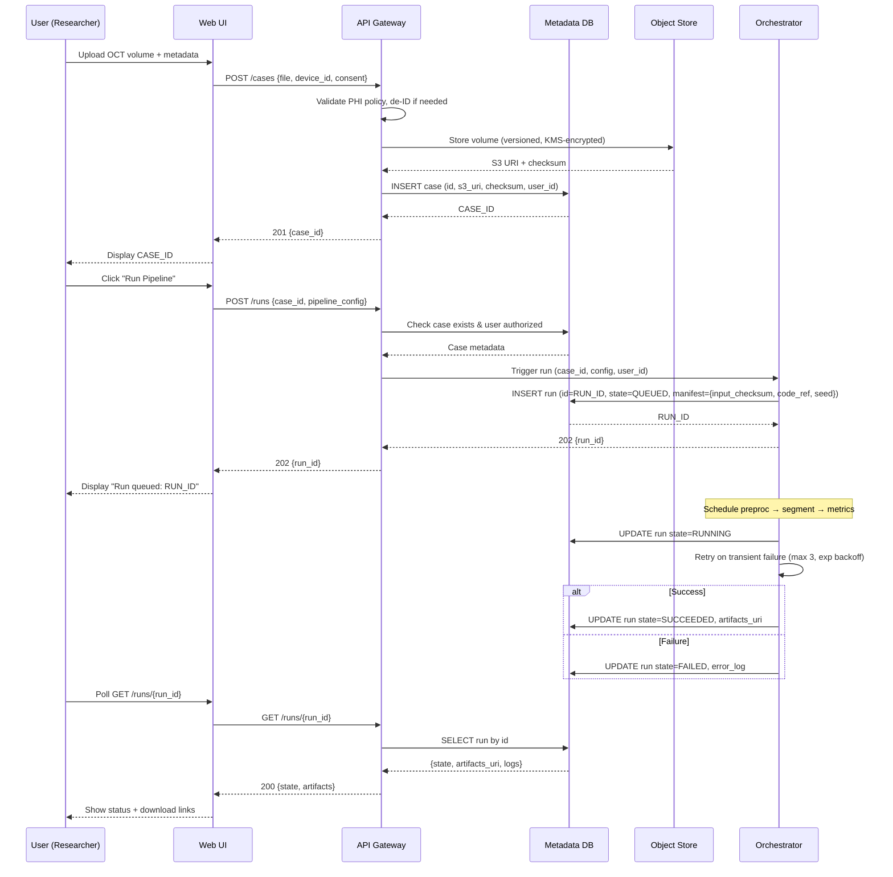
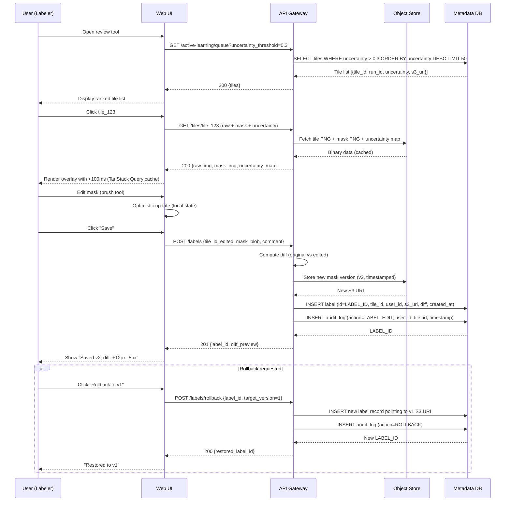
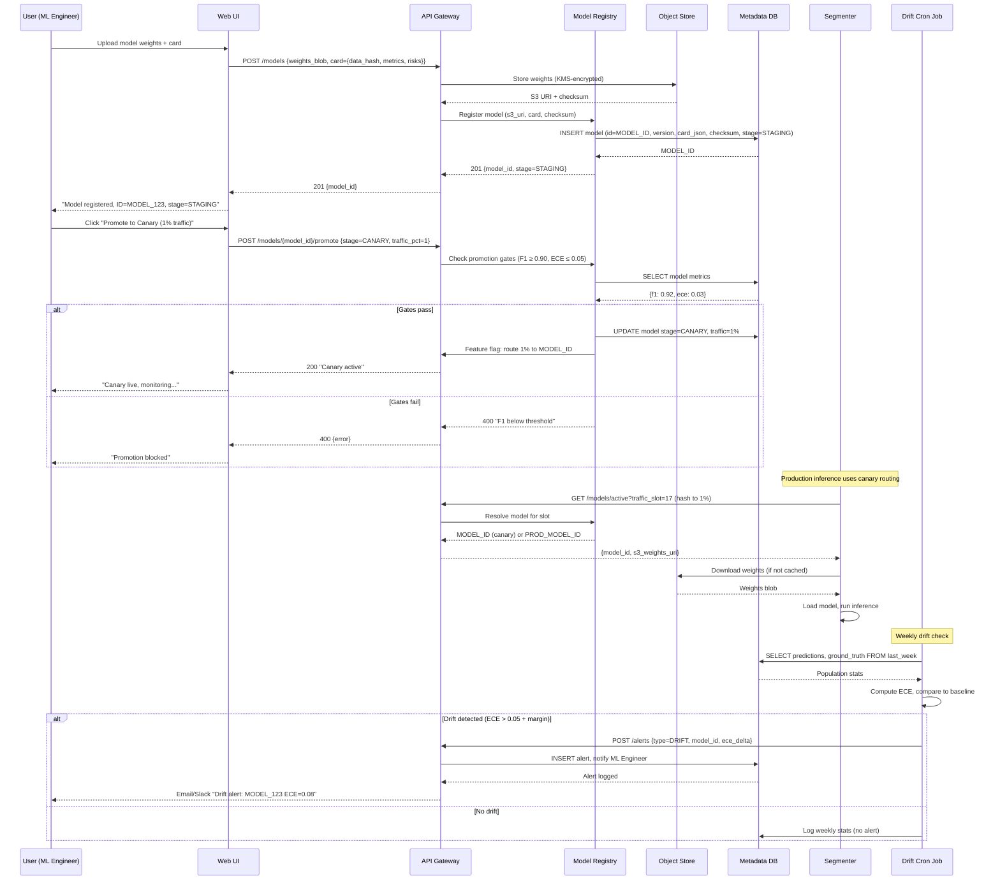

# Design: Sequence Diagrams

## Diagram 1: Upload Volume and Trigger Run

**Annotations**:
- **Idempotency**: Re-POST same `case_id + config` returns existing `RUN_ID` if manifest identical.
- **Timeout**: Orchestrator jobs have 1h deadline; auto-fail and log.
- **Error**: API returns 4xx for validation, 503 if Orchestrator unavailable.

**Stories**: Upload volume, RUN_ID tracking, idempotent retries  
**SRS**: FR-001, FR-002, FR-003, FR-004, NFR-R-01

---

## Diagram 2: Review and Edit Mask with Active Learning

**Annotations**:
- **Tile fetch**: Cached client-side (TanStack Query); 512×512 PNG ~100KB → <100ms (NFR-U-01).
- **Optimistic UI**: Mask overlay updates instantly; server confirmation async.
- **Versioning**: Each edit creates new label record; diffs stored as JSON.

**Stories**: Edit mask, active-learning queue, overlay viz  
**SRS**: FR-050, FR-051, U-02, NFR-U-01

---

## Diagram 3: Register Model, Canary Deploy, Drift Alert

**Annotations**:
- **Promotion gates**: Automated check against NFR-A-01, NFR-A-02; manual override requires admin role.
- **Shadow traffic**: API Gateway routes 1% via consistent hash (user_id or run_id mod 100).
- **Rollback**: POST `/models/{id}/rollback` sets traffic to 0%, reverts to last PROD model (one-click).

**Stories**: Register model, canary deploys, drift alerts  
**SRS**: FR-060, FR-061, FR-062, NFR-A-01, NFR-A-02