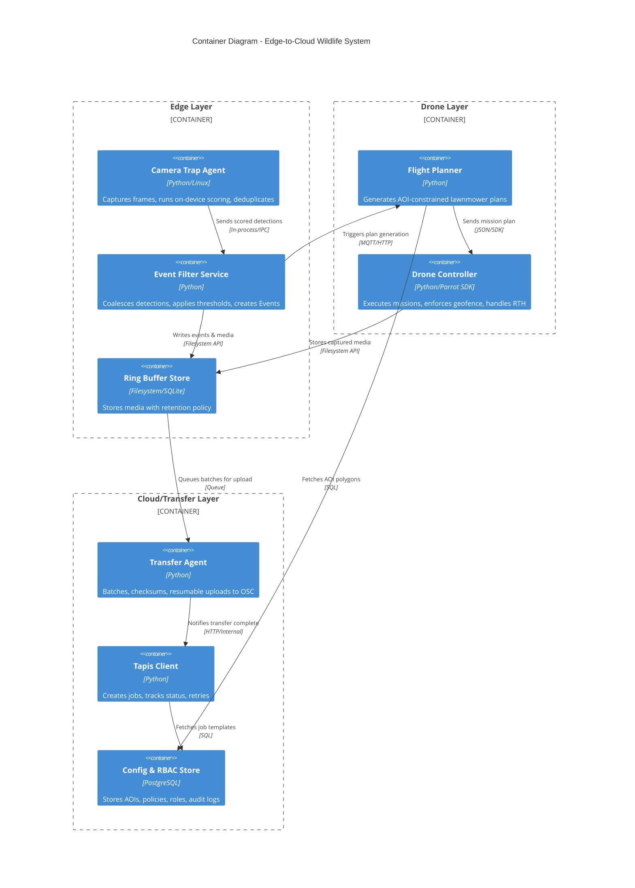

# C4: Container

## Container Diagram - Edge-to-Cloud Wildlife System

````

**Caption:**  
Eight containers span edge (camera trap, event filter, ring buffer), drone (planner, controller), and cloud/transfer (agent, Tapis client, config store). Data flows from detection to scoring, event filtering, flight planning, drone capture, buffering, transfer, and job submission.

**Container Responsibilities:**

### Edge Layer
- **Camera Trap Agent:** Motion-triggered capture, on-device ML inference (≤2s/frame), perceptual hashing for deduplication
- **Event Filter Service:** Applies species/confidence thresholds, temporal coalescing (30s windows), rate limiting, alert generation
- **Ring Buffer Store:** Configurable retention (age/size), atomic writes, purge on delivery confirmation

### Drone Layer
- **Flight Planner:** Wind-adaptive lawnmower patterns, battery feasibility checks, AOI-bounded waypoint generation, mission segmentation
- **Drone Controller:** Parrot Anafi SDK integration, geofence enforcement, RTH failsafe, real-time telemetry logging

### Cloud/Transfer Layer
- **Transfer Agent:** Chunked multipart upload (5MB chunks), checksum verification, exponential backoff on failures, adaptive throttling
- **Tapis Client:** Job template instantiation, polling with backoff, retry logic (max 3 attempts), status persistence
- **Config & RBAC Store:** Versioned AOIs/policies, role-based access control, immutable audit logs (180 days)

**Technology Choices:**
- Python for portability and ML library support (TensorFlow Lite, OpenCV)
- PostgreSQL for ACID compliance and geospatial queries (PostGIS)
- MQTT for low-bandwidth edge messaging with offline buffering
- Parrot SDK for certified drone control with safety guarantees

